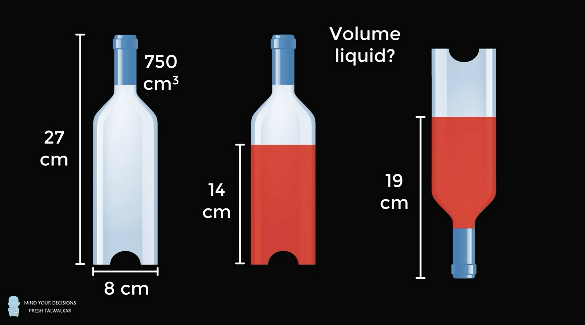

# Volume Of Liquid In The Bottle

I came accross a problon on a youtube channel called [MindYourDecisions](https://www.youtube.com/@MindYourDecisions  "Visit the youtube Channel") for the second problem in the [video](https://youtu.be/ex7ag9U-dzU?si=1UdBRqLvYV7OSOCg&t=36). In it the answer to this solution 525.80 cm3.

My Solution:  

Let A be the volume of liquid when when the bottle is upside down 

Let B be the volume of liquid when its up right 

let A = B = V 

Now:

$A \bigcup\ B = A + B - A \bigcap\ B$ --(1)

We Know that the length of the bottle is 27 cm when rightside up the volume goes up to 19 cm and when right side up is 14 cm.   

$Height Of the Common Volume between A and B is = (Upper Cap from right side up) - (Lower Cap from right side up)$

 

$ = (14) - (27-19) = 6 cm $

Therefore Volume of Common Section is ($A \bigcap\ B$) = $\pi*r^{2}*6$, where r = 4  

$A \bigcap\ B = 96\pi$ -- (2)

Substituting (2) in (1): 

$A \bigcup\ B = A + B - 96\pi$  

$750 = A + B - 96\pi$  , since $A \bigcap\ B$ is the volume of bottle   

$750 = V + V - 96\pi$ , A=B=V  

$V = (750+96\pi)/2$  

$V = 525.79 cm^{3}$

